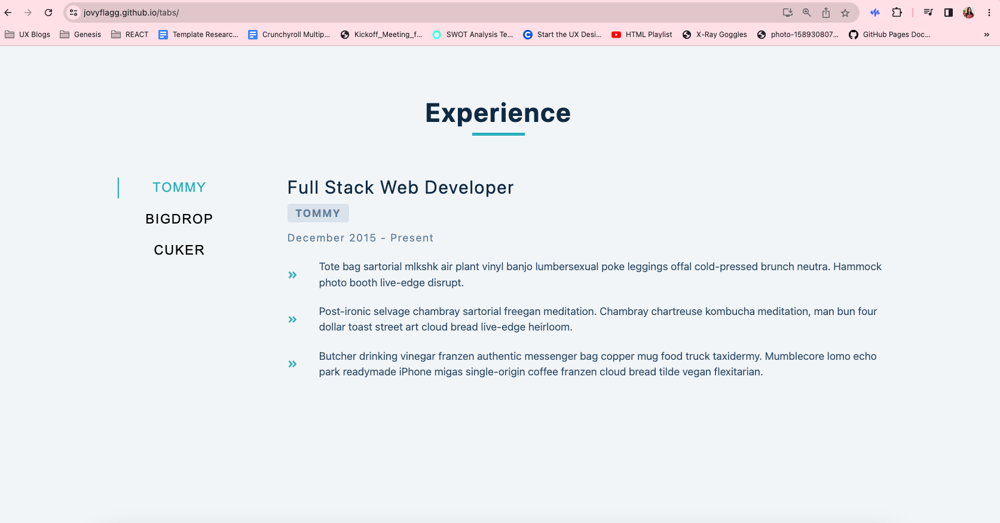
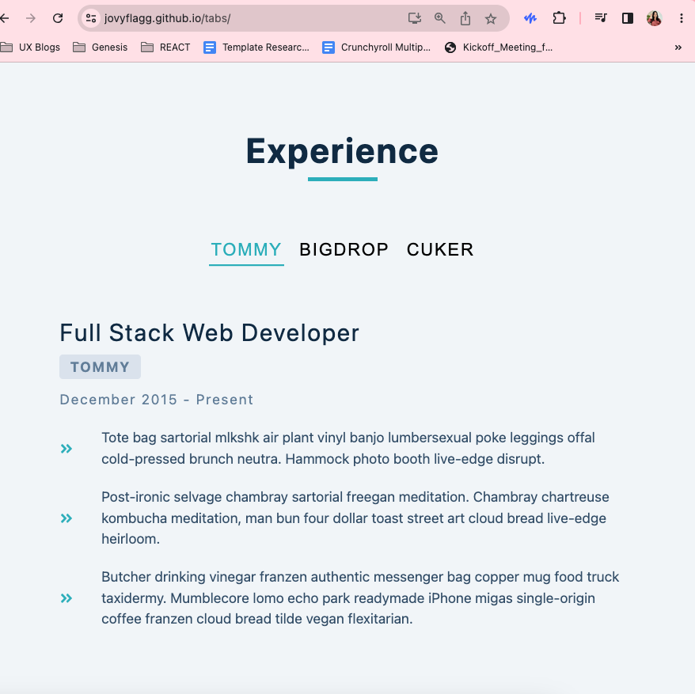

### Project: Tabs using Axios

(Larger screen)



(smaller screen)



#### Link to Github Page

[🗂️ Tabs Project (Click here)](https://jovyflagg.github.io/tabs/)

#### Axios
[axios](https://www.npmjs.com/package/axios)

1. On your project, run the following on your terminal:
```
npm install axios --save
```

2. Create axios.js file and include the following:
```javascript
import axios from 'axios';
export const client = axios.create({
  baseURL: '<PASTE URL HERE>'
});
```
3. Import 'client' to the file you'll be calling the API endpoint:

```javascript
import { client } from './axios';

```


#### React Icons

[react icons](https://react-icons.github.io/react-icons/)

```
npm install react-icons --save
```

```javascript
import { FaHome } from 'react-icons/fa';
const Component = () => {
  return <FaHome className='icon'></FaHome>;
};
```
